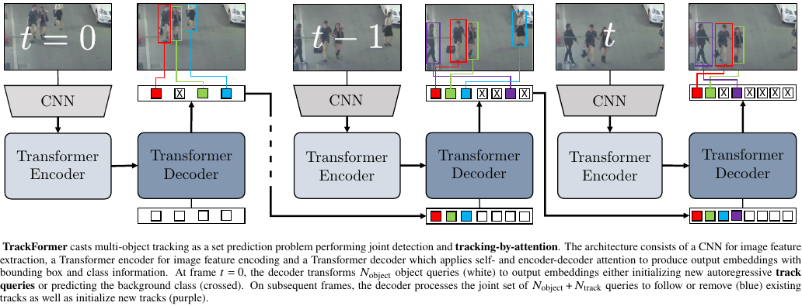

# TrackFormer: Multi-Object Tracking with Transformers

This repository provides the official implementation of the [TrackFormer: Multi-Object Tracking with Transformers](https://arxiv.org/abs/2101.02702) paper by [Tim Meinhardt](https://dvl.in.tum.de/team/meinhardt/), [Alexander Kirillov](https://alexander-kirillov.github.io/), [Laura Leal-Taixe](https://dvl.in.tum.de/team/lealtaixe/) and [Christoph Feichtenhofer](https://feichtenhofer.github.io/). The codebase builds upon [DETR](https://github.com/facebookresearch/detr), [Deformable DETR](https://github.com/fundamentalvision/Deformable-DETR) and [Tracktor](https://github.com/phil-bergmann/tracking_wo_bnw).

<!-- **As the paper is still under submission this repository will continuously be updated and might at times not reflect the current state of the [arXiv paper](https://arxiv.org/abs/2012.01866).** -->

<div align="center">
    
    
</div>

## Abstract

The challenging task of multi-object tracking (MOT) requires simultaneous reasoning about track initialization, identity, and spatiotemporal trajectories.
We formulate this task as a frame-to-frame set prediction problem and introduce TrackFormer, an end-to-end MOT approach based on an encoder-decoder Transformer architecture.
Our model achieves data association between frames via attention by evolving a set of track predictions through a video sequence.
The Transformer decoder initializes new tracks from static object queries and autoregressively follows existing tracks in space and time with the new concept of identity preserving track queries.
Both decoder query types benefit from self- and encoder-decoder attention on global frame-level features, thereby omitting any additional graph optimization and matching or modeling of motion and appearance.
TrackFormer represents a new tracking-by-attention paradigm and yields state-of-the-art performance on the task of multi-object tracking (MOT17) and segmentation (MOTS20).

<div align="center">
    
</div>

## Installation

We refer to our [docs/INSTALL.md](docs/INSTALL.md) for detailed installation instructions.

## Train TrackFormer

We refer to our [docs/TRAIN.md](docs/TRAIN.md) for detailed training instructions.

## Evaluate TrackFormer

In order to evaluate TrackFormer on a multi-object tracking dataset, we provide the `src/track.py` script which supports several datasets and splits interchangle via the `dataset_name` argument (See `src/datasets/tracking/factory.py` for an overview of all datasets.) The default tracking configuration is specified in `cfgs/track.yaml`. To facilitate the reproducibility of our results, we provide evaluation metrics for both the train and test set.

### MOT17

#### Private detections

```
python src/track.py with reid
```
<center>

| MOT17     | MOTA         | IDF1           |       MT     |     ML     |     FP       |     FN              |  ID SW.      |
|  :---:    | :---:        |     :---:      |    :---:     | :---:      |    :---:     |   :---:             |  :---:       |
| **Train** |     68.1     |     67.6       |    816       | 207        |     33549    |     71937           |  1935        |
| **Test**  |     65.0     |     63.9       |    1074      | 324        |     70443    |     123552          |  3528        |


</center>

#### Public detections (DPM, FRCNN, SDP)

```
python src/track.py with \
    reid \
    public_detections=min_iou_0_5 \
    obj_detect_checkpoint_file=models/mots20_train_masks/checkpoint.pth
```
<center>

| MOT17     | MOTA         | IDF1           |       MT     |     ML     |     FP       |     FN              |  ID SW.      |
|  :---:    | :---:        |     :---:      |    :---:     | :---:      |    :---:     |   :---:             |  :---:       |
| **Train** |     67.2     |     66.9       |    663       | 294        |     14640    |     94122             |  1866         |
| **Test**  |     62.5     |     60.7       |    702       | 632        |     32828    |     174921          |  3917        |


</center>

### MOTS20

```
python src/track.py with \
    dataset_name=MOTS20-ALL \
    obj_detect_checkpoint_file=models/mots20_train_masks/checkpoint.pth
```

Our tracking script only applies MOT17 metrics evaluation but outputs MOTS20 mask prediction files. To evaluate these download the official [MOTChallengeEvalKit](https://github.com/dendorferpatrick/MOTChallengeEvalKit).

<center>

| MOTS20    | sMOTSA         | IDF1           |       FP     |     FN     |     IDs      |
|  :---:    | :---:        |     :---:      |    :---:     | :---:      |    :---:     |
| **Train** |     --       |     --         |    --        |   --       |     --       |
| **Test**  |     54.9       |     63.6         |    2233        | 7195         |     278       |

</center>

### Demo

To facilitate the application of TrackFormer, we provide a demo interface which allows for a quick processing of a given video sequence.

```
ffmpeg -i data/snakeboard/snakeboard.mp4 -vf fps=30 data/snakeboard/%06d.png

python src/track.py with \
    dataset_name=DEMO \
    data_root_dir=data/snakeboard \
    output_dir=data/snakeboard \
    write_images=pretty
```

<div align="center">
    
</div>

## Publication
If you use this software in your research, please cite our publication:

```
@InProceedings{meinhardt2021trackformer,
    title={TrackFormer: Multi-Object Tracking with Transformers},
    author={Tim Meinhardt and Alexander Kirillov and Laura Leal-Taixe and Christoph Feichtenhofer},
    year={2021},
    eprint={2101.02702},
    archivePrefix={arXiv},
}
```
